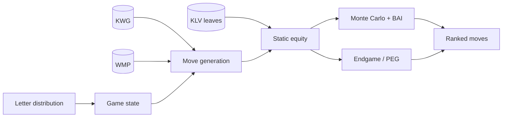

# Architecture

> **Status:** outline — prose to be written.
> **Sources:** `src/impl/`, `src/ent/`, `src/def/`

## Subsystem overview

<!-- NOTE: narrate the layering — def/ (constants & POD types), ent/ (entities:
     board, game, kwg, klv, wmp, equity), impl/ (algorithms), str/ (formatting),
     util/, compat/. Then the data-flow from a rack+board to a ranked move. -->

## Data flow

<!-- NOTE: replace/refine this diagram as the real call graph is documented.
     This also serves as a Mermaid smoke test for the build. -->

## Concurrency model

<!-- NOTE: thread control, worker pools (sim, endgame, peg_pool), atomics,
     and how async stop/status interrupt long runs. Cross-link the dev guide. -->

## Where to read next

<!-- NOTE: signpost the per-subsystem pages. -->
